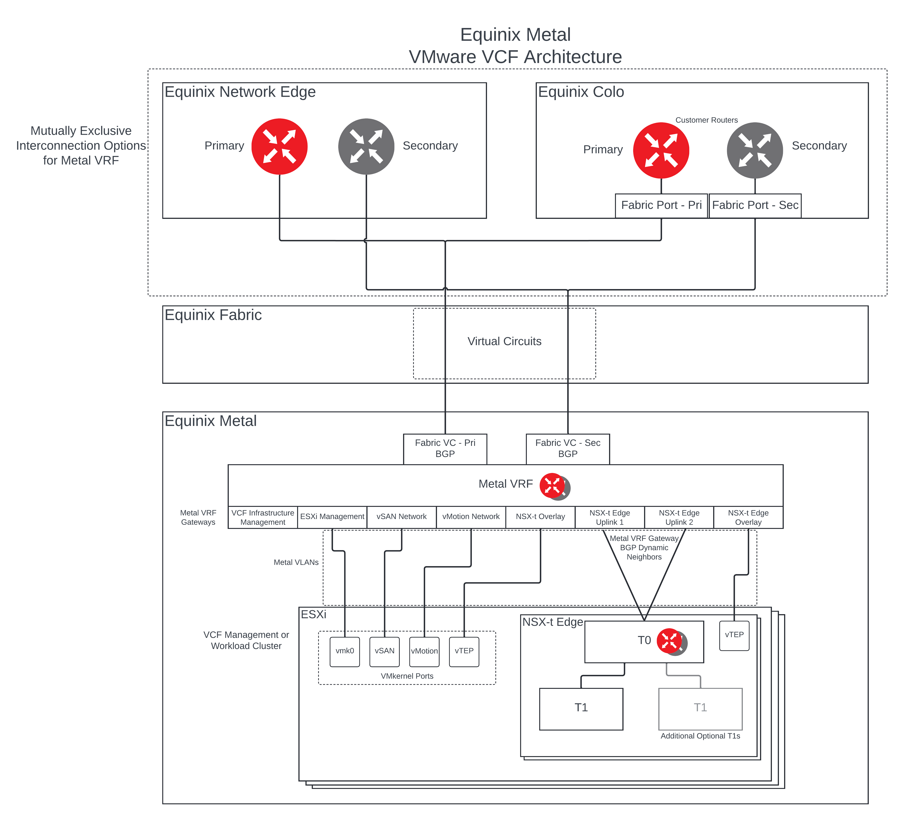

# tfm-eqix-metal-vcf
Module based Terraform project for deploying VMware VCF resources on Equinix Metal

## Target Architecture



Target Metal Architecture featuring Metal VRF for Underlay routing

## Pre-Requisites

### **This module <ins>does not</ins> provide for the following VCF Infrastructure requirements.**

#### Physical Network

* DHCP with an appropriate scope size (one IP per physical NIC per host) is configured for the ESXi Host Overlay (TEP) network. Providing static IP pool is also supported but some Day-N operations like stretching a cluster will not be allowed if static IPs are used.

#### Physical Hardware and ESXi Host

* Hardware and firmware (including HBA and BIOS) is configured for vSAN.
    * > **Note:** The Equinix Support team can assist with ensuring that BIOS configuration is brought into compliance with vSAN recommendations should it be discovered that this is not already the case.

* Physical hardware health status is 'healthy' without any errors.

    * > **Note:** The Equinix Support team can assist with ensuring hardware is brought into a healthy state should it be discovered otherwise.


* All hosts are in synchronization with a central time server (NTP). 

    * > **Note:** While this module does configure the user provided NTP server details, the provided NTP server IP must be reachable by the Metal Instances through VRF Interconnection.

#### Supporting Infrastructure

* DNS server for name resolution. Management IP of hosts is registered and queryable as both a forward (hostname-to-IP), and reverse (IP-to-Hostname) entry.
    * > **Note:** While this module does configure the user provided DNS server details, the provided DNS server IP must be reachable by the Metal Instances through VRF Interconnection.

---
### This module <ins>does</ins> provide for the following VCF Infrastructure requirements as required by Cloud Builder

#### Physical Network

* Top of Rack switches are configured. Each host and NIC in the management domain must have the same network configuration. No ethernet link aggregation technology (LAG/VPC/LACP) is being used.

* IP ranges, subnet mask, and a reliable L3 (default) gateway for each VLAN are provided.

* Jumbo Frames (MTU 9000) are recommended on all VLANs. At a minimum, MTU of 1600 is required on the NSX Host Overlay VLAN and must be enabled end to end through your environment.

* VLANs for management, vMotion, vSAN and NSX Host Overlay networks are created and tagged to all host ports. Each VLAN is 802.1q tagged.

* Management IP is VLAN backed and configured on the host. vMotion & vSAN IP ranges are configured during the bring-up process.

#### Physical Hardware and ESXi Host

* All servers are vSAN compliant and certified on the VMware Hardware Compatibility Guide, including but not limited to BIOS, HBA, SSD, HDD, etc.

* Identical hardware (CPU, Memory, NICs, SSD/HDD, etc.) within the management cluster is highly recommended. Refer to vSAN documentation for minimal configuration.

* One physical NIC is configured and connected to the vSphere Standard switch. The second physical NIC is not configured.

* ESXi is freshly installed on each host. The ESXi version matches the build listed in the Cloud Foundation Bill of Materials.

* All hosts are configured with a central time server (NTP). NTP service policy set to 'Start and stop with host'.

* Each ESXi host is running a non-expired license - initial evaluation license is accepted. The bring-up process will configure the permanent license provided.

#### Supporting Infrastructure

* All hosts are configured with a DNS server for name resolution.


## Custom root password

### Generating custom root password
To generate a password hash of your desired ESXi root password run the 'mkpasswd' command on a Linux system with the 'whois' package installed as follows

```shell
mkpasswd --method=SHA-512
```
You'll be prompted to enter the desired password sting you wish to hash, then press enter. 


The output will be the string you need to use in the esxi_password variable near the end of the terraform.tfvars.example file